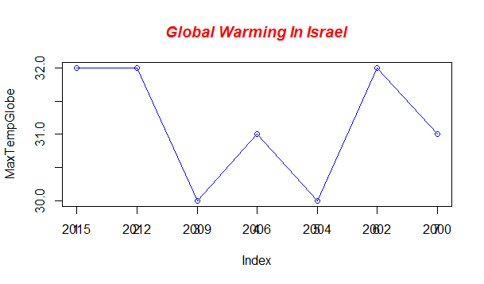
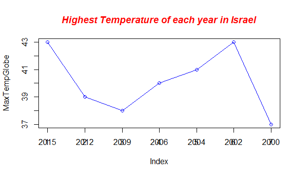
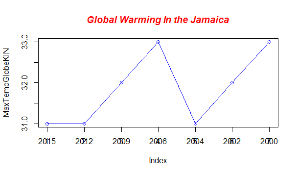
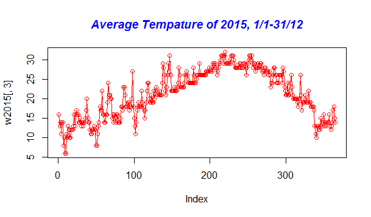
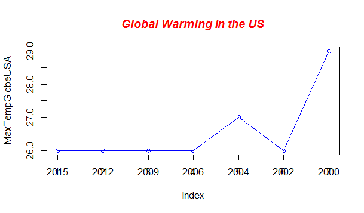

# Global-Warming

Global warming and climate change are terms for the observed century-scale rise in the average temperature of the Earth's climate system and its related effects.
multiple lines of scientific evidence show that the climate system is warming,  On 12 November 2015, NASA scientists reported that human-made carbon dioxide (CO2) continues to increase above levels not seen in hundreds of thousands of years and the graph that show's the highest average day temperature of the last 15 years in Israel show's a drastic rising of temperature around 2015.
  

I assume that the climate change in earth is like a sinus wave, it goes up and down, almost as if the earth keep changing he's Min and Max temperatue to "fix it's self".
 
As you can see in the next graph, the tempature is going from the buttom to the top of the graph and back to the buttom, and if we will glue the average of 2014 to it's back we will see a wave that repeating it self.
So if the tempature of the whole year is repeating it self, and the global tempature of the last 15 years keeps going up and down, means that we'r very far from global extinction. :)  

- [ ] I took data of min, max and avrg temperature that was recorded in Israel,USA and Jamaica.
- [ ] I looked for the highest temperature that was recorded for each year for the last 15 years or so.
- [ ] I have substract from the highest temperatue of 2015 each highste temperature of each year for the last 15 years to see the correlation.

- [ ] To continue conducting the research we should use more old data, from varies of citys in the globe and compare it to the current data of the weather, max_tempature etc.

| Date | Max_Tempature | Avrg_Tempature | Min_Tempature |
| --- | --- | --- | --- |
|2015-01-01 | 21 | 16 | 11 |
|2015-01-02|17|13|9|
|2015-01-03|18|14|10|
|2015-01-04|14|11|8|
|2015-01-05|18|14|11|
|2015-01-06|16|14|12|
|2015-04-08|38|27|14|
|2015-04-09|21|18|15|
|2015-04-10|18|15|12|
|2015-04-11|17|13|10|
|2015-11-27|27|19|12|
|2015-11-28|25|19|12|
|2015-11-29|23|18|12|

